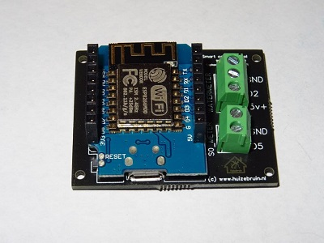
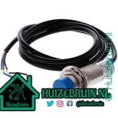
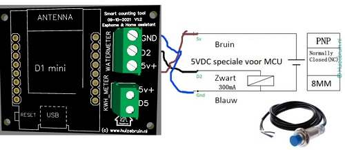
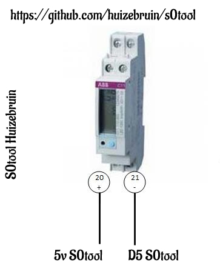

| Repository Status | ESPHome S0tool discord Community |
| :--- | :--- |
| [![last commit time][github-last-commit]][github-master] [![GitHub Activity][commits-shield]][commits] | [![Discord][discord-shield]][discord]  
|  [![License][license-shield]](LICENSE) [![Forks][forks-shield]][forks-url] [![Stargazers][stars-shield]][stars-url] [![Issues][issues-shield]][issues-url] | [![Contributors][contributors-shield]][contributors-url] [](https://GitHub.com/huizebruin/s0tool/releases/)| 


|  S0tool | ESPHome program  |
| :--- | :--- |
|    |  |


|  S0tool | Dashboard  |
| :--- | :--- |
|    |  |


 
<br><br>
# De <b>s0tool</b> bestellen?
https://www.huizebruin.nl/webshop </br>
Ik heb nog een aantal pcb's welke ik kan gaan klaar maken voor verkoop.<br>
En mocht er meer vraag naar zijn ga ik nieuwe printen bestellen.

In <b>v1</b> zit een klein foutje, in de s0 aansluiting zit de <b>GND</b> I.P.V <b>5v+</b>.<br>
Dat werkt niet,  dit is een ontwerpfoutje. <br>
Er moet dus een kabeltje vanaf de 5v+ op het printje naar poort 20 op je kWh meter.<br>
En het andere kabeltje gaat vanaf de D5 aansluiting op het printje naar poort 21 op de kWh meter.

Voor meer informatie en aansluitschema's etc kijk dan even op de [website](https://www.huizebruin.nl/home-assistant/wat-is-de-s0tool/).
# Update:
| Datum | Informatie |
| :--- | :--- |
| 05/05/2022 | V2 is binnen maar moet nog getest worden.|
| 06/05/2022 | Nu ook mogelijk om de <b>s0tool</b> direct via de browser te flashen. [https://huizebruin.github.io/s0tool/](https://huizebruin.github.io/s0tool/)
| 25/07/2022 | Watermeter geeft nu liter per minuut aan met vertraging van 2 seconden.|
***

### Software update informatie zie de [releases](https://github.com/huizebruin/s0tool/releases) sectie op github.
***

# Hardware
Vul eerst uw  🛒 of kijk of je de onderstaande componenten al hebt .
#
## Voeding
- Minimaal 5v 1A [Bol.com](https://partner.bol.com/click/click?p=2&t=url&s=1097464&f=TXL&url=https%3A%2F%2Fwww.bol.com%2Fnl%2Fnl%2Fp%2Funiversal-usb-adapter-usb-stekker-usb-lader-blokje-universeel-zwart%2F9300000030638594%2F&name=Universal%20USB%20adapter%20-%20USB%20stekker%20-%20USB%20lader) 
- usb kabel [Bol.com](https://partner.bol.com/click/click?p=2&t=url&s=1097464&f=TXL&url=https%3A%2F%2Fwww.bol.com%2Fnl%2Fnl%2Fp%2Fzware-kwaliteit-0-3-m-usb-oplaadkabel-oplaadsnoer-kabel-voor-snelladen-past-ook-op-huawei-ascend-3-ideos-x3-mate-10-lite-mate-8-mate-s-p-smart-p10-lite-p8-lite%2F9200000124489693%2F&name=Zware%20kwaliteit%200%2C3%20m%20USB%20oplaadkabel.%20) of [opencircuit.nl](https://opencircuit.nl/product/Micro-USB-kabel-100cm-blauw-30AWG?affiliate=1VL4KIAMBZ)

Of een alles in 1 lader met snoer [Opencircuit.nl](https://opencircuit.nl/product/5V-2.5A-Adapter-Micro-USB-B-Raspberry-Pi?affiliate=1VL4KIAMBZ) of bij [Bol.com](https://partner.bol.com/click/click?p=2&t=url&s=1097464&f=TXL&url=https%3A%2F%2Fwww.bol.com%2Fnl%2Fnl%2Fp%2Fxssive-usb-lader-met-micro-usb-kabel-voor-motorola-smartphones-o-a-moto-x-moto-g-moto-e-nexus-6%2F9200000055360796%2F&name=Xssive%20USB%20Lader%20met%20Micro%20USB%20Kabel%20).
#
## Voor de watermeter
- NPN sensor - [Aliexpress](https://s.click.aliexpress.com/e/_AaxBxa) of [Aliexpress](https://s.click.aliexpress.com/e/_ADG3ri) of [Aliexpress](https://s.click.aliexpress.com/e/_A4Lsko) of in Nederland bij [Opencircuit.nl](https://opencircuit.nl/product/lj18a3-8-z-bx-5v-nabijheids-sensor-n-o-npn-8mm?affiliate=1VL4KIAMBZ)
- (Zorg ervoor dat het sensoren voor 5V zijn niet 6V of hoger!!) Ik gebruik zelf de LJ18A3-8-Z/BX-5V <br> <br><br>
Binnenkort ook read sensor voor de Elster V100	kogelvorm meter meter bestellen welke ook werkt met de S0tool houd de webshop in de gaten.

Voor meer informatie en aansluitschema's etc kijk dan even op de [website](https://www.huizebruin.nl/home-assistant/wat-is-de-s0tool/).

***
## Voor het bijhouden van zonnepanelen of warmtepomp etc.
- kWh meter met 1000 pulsen per kWh [bol.com](https://partner.bol.com/click/click?p=2&t=url&s=1097464&f=TXL&url=https%3A%2F%2Fwww.bol.com%2Fnl%2Fnl%2Fp%2Fsdm120d-mid-1-fase-kwh-meter-met-puls-uitgang%2F9200000112029366%2F&name=SDM120D%20MID%20-%201%20Fase%20kWh%20meter%20met%20puls%20uitgang)
- kWh meter met 2000 pulsen per kWh [bol.com](https://partner.bol.com/click/click?p=2&t=url&s=1097464&f=TXL&url=https%3A%2F%2Fwww.bol.com%2Fnl%2Fnl%2Fp%2Felektronische-wattmeter-greenblue-gb173-voor-zowel-prive-als-handel-industrie%2F9200000115897616%2F&name=Elektronische%20wattmeter%20GreenBlue%20GB173) <br>

Worden er 2000 pulsen per kWh gegeven. Dit wil dus zeggen dat elke plus een waarde van 1/2000 = 0.0005 kWh
Worden er 1000 pulsen per kWh gegeven. Dit wil dus zeggen dat elke plus een waarde van 1/1000 = 0.001 kWh

2000 imp/kWh : geeft 2.000 impulsen per kWh. is dus nauwkeuriger om een meting te doen dan de 1000 imp/KWh
Hoe meer energie u verbruikt of terug levert, des te sneller zal hij gaan schakelen.<br>


<br>
#
## De s0 aansluiting <br>
<br>
In <b>v1</b> zit een klein foutje, in de s0 aansluiting zit de<b>GND</b> I.P.V <b>5v+</b>.<br>
Dat werkt niet,  dit is een ontwerpfoutje. <br>
Er moet dus een kabeltje vanaf de 5v+ op het printje naar poort 20 op je kWh meter.<br>
En het andere kabeltje gaat vanaf de D5 aansluiting op het printje naar poort 21 op de kWh meter.
<br> Sinds 01-07-2022 wordt alleen nog maar V2 verstuurd.
***
<br>

## Installatie: 

06/05/2022: <br> Nu ook mogelijk om de <b>s0tool</b> direct via de browser te flashen.<br>
Alleen mogelijk met een chrome of edge en opera browser. <br>
Verbind de s0tool met een usb kabel aan je pc/ laptop en start de procedure.
 [https://huizebruin.github.io/s0tool/](https://huizebruin.github.io/s0tool/)

1. Installeer Home Assistant & Esphome .
2. Connect de wemos d1 mini aan een usblader.
3. Ga met je laptop of telefoon naar     <b>ssid:</b> ```S0tool``` &   <b> password:</b> ```s0watermeter```
4. Ga naar ```192.168.4.1```.
5. Zet de juiste SSID en Wachtwoord in de velden
6. Wacht tot hij klaar is, en dan geeft hij het adres aan waar hij op te vinden is ( zet die vast in je router)
7. Ga naar je Home Assistant instalatie, deze zal gaan melden dat er een nieuw device gekoppeld is. En voeg deze toe.
8. Als het goed is gaat de print connectie maken met Github om de laatste versie binnen te halen, en daardoor ook toe te voegen aan Esphome
9. Maak een map aan in je config map via de verkenner en noem deze ``` utility_meter ``` en plaats daar weer een tekst bestand in en hernoem deze naar utility.yaml, en voeg onderstaande code daar in toe. En sla deze op( of download hem uit deze repro) en plaats hem in die map. (Code die onder 10 staat)
10. Voeg de volgende code toe aan je 
``` configuration.yaml   ```
<br> ``` utility_meter: !include utility_meter/utility.yaml ```

``` yaml
#utility_meter:
### watermeter  S0 meter
  waterverbruik_kwartier:
    source: sensor.watermeter_totaal
    cycle: quarter-hourly
  waterverbruik_per_uur:
    source: sensor.watermeter_totaal
    cycle: hourly
enz...
```
Die in de file staan in de map [utility_meter/utility.yaml](https://github.com/huizebruin/s0tool/blob/main/utility_meter/utility.yaml) 

12. Optioneel om te zien of er nieuwe updates zijn, kun je de volgende sensor aanmaken in je configuration.yaml:<br>
(of je kopieert de sensor file uit de sensor map en plaatst dat allemaal in je eigen configuratie).
```yaml
#sensor: # ervoor weg als dit je eerste sensor is
  - platform: rest
    resource: https://api.github.com/repos/huizebruin/s0tool/releases/latest
    name: s0tool_versie_github
    value_template: '​{{ value_json.tag_name }}​'

```
Deze versie kun je dan vergelijken met de entity "sensor.s0tool_versie".<br>
Deze 2 staan ook in de sensor map op deze Github.

13. Herstart Home Assistant nog een maal om alles toe te kunnen voegen aan je Lovelace scherm.

14. Voeg deze kaart toe om automatisch een update te krijgen op je dashboard, daarmee weet je of je de laatste versie gebruikt.

``` yaml
type: conditional
conditions:
  - entity: sensor.s0tool_gelijk_github
    state_not: 'True'
card:
  type: markdown
  content: De s0tool is niet up to date met de GitHub versie.
```
***


## Blueprint voor update meldingen.
Hiermee kun je een automation maken waardoor je melding krijgt als er een nieuwe versie online staat op Github.
Je moet dan wel alle bovenstaande sensoren hebben toegevoegd.
<br>
[](https://my.home-assistant.io/redirect/blueprint_import/?blueprint_url=https%3A%2F%2Fgist.github.com%2Fhuizebruin%2Fcc87171b7974517497fbb55cd4bef83e)


***
## Aanpassen van de meter stand
Voor het aan passen van de water meter stand : 
[](https://my.home-assistant.io/redirect/developer_call_service/?service=ESPHome%3A+s0tool_meterstand_water)
<br><br>
Voor het aanpassen van je kwh meter stand : [](https://my.home-assistant.io/redirect/developer_call_service/?service=ESPHome%3A+s0tool_meterstand_kwh)
<br><br>
Of deze optie en dan zoeken naar de juiste meter en dan aanpassen,<br> hier kan je alle meterstanden updaten: 
[](https://my.home-assistant.io/redirect/developer_call_service/?service=Nutsmeter%3A+Calibrate)

***

Veel plezier met deze tool.<br>
Eventuele toevoegingen / verbeteringen <br> mogen via <b>[Pull requests](https://github.com/huizebruin/s0tool/pulls)</b> aangevuld worden.<br> 
Of via <b>[issues](https://github.com/huizebruin/s0tool/issues) </b> aangevraagd en of toegevoegd worden.
<br><br><b>
Wobbe van Huizebruin.nl</b>
<br><br>
Voor meer informatie en aansluitschema's etc kijk dan even op de [website](https://www.huizebruin.nl/home-assistant/wat-is-de-s0tool/).
***

## Meewerken.
Dit is een actief open-sourceproject. <br>
We staan ​​altijd open voor mensen die de code willen gebruiken of eraan willen bijdragen.

Wie werken er nog meer aan dit project : <br>
<br>
## Collaborators

<!-- readme: collaborators -start -->
<table>
<tr>
    <td align="center">
        <a href="https://github.com/So871">
            
            <br />
            <sub><b>So871</b></sub>
        </a>
    </td>
    <td align="center">
        <a href="https://github.com/huizebruin">
            
            <br />
            <sub><b>Wobbe </b></sub>
        </a>
    </td></tr>
</table>
<!-- readme: collaborators -end -->

## Contributors

<!-- readme: contributors -start -->
<table>
<tr>
    <td align="center">
        <a href="https://github.com/huizebruin">
            
            <br />
            <sub><b>Wobbe </b></sub>
        </a>
    </td>
    <td align="center">
        <a href="https://github.com/So871">
            
            <br />
            <sub><b>So871</b></sub>
        </a>
    </td>
    <td align="center">
        <a href="https://github.com/TheGabeMan">
            
            <br />
            <sub><b>Gabrie Van Zanten</b></sub>
        </a>
    </td>
    <td align="center">
        <a href="https://github.com/ImgBotApp">
            
            <br />
            <sub><b>Imgbot</b></sub>
        </a>
    </td>
    <td align="center">
        <a href="https://github.com/bas-val">
            
            <br />
            <sub><b>Bas-val</b></sub>
        </a>
    </td></tr>
</table>
<!-- readme: contributors -end -->
****

## License

MIT License

Copyright (c) 2021 / 2022 Huizebruin

Permission is hereby granted, free of charge, to any person obtaining a copy of this software and associated documentation files (the "Software"), to deal in the Software without restriction, including without limitation the rights to use, copy, modify, merge, publish, distribute, sublicense, and/or sell copies of the Software, and to permit persons to whom the Software is furnished to do so, subject to the following conditions:

The above copyright notice and this permission notice shall be included in all copies or substantial portions of the Software.

THE SOFTWARE IS PROVIDED "AS IS", WITHOUT WARRANTY OF ANY KIND, EXPRESS OR IMPLIED, INCLUDING BUT NOT LIMITED TO THE WARRANTIES OF MERCHANTABILITY, FITNESS FOR A PARTICULAR PURPOSE AND NONINFRINGEMENT. IN NO EVENT SHALL THE AUTHORS OR COPYRIGHT HOLDERS BE LIABLE FOR ANY CLAIM, DAMAGES OR OTHER LIABILITY, WHETHER IN AN ACTION OF CONTRACT, TORT OR OTHERWISE, ARISING FROM, OUT OF OR IN CONNECTION WITH THE SOFTWARE OR THE USE OR OTHER DEALINGS IN THE SOFTWARE.

***

<a href="https://tc.tradetracker.net/?c=27&amp;m=39668&amp;a=385034&amp;r=&amp;u=" target="_blank" rel="sponsored nofollow">Geld verdienen met je site. Start nu, meldt je hier aan.</a>


[commits-shield]: https://img.shields.io/github/commit-activity/m/huizebruin/s0tool.svg
[commits]: https://github.com/huizebruin/s0tool/commits/main
[github-last-commit]: https://img.shields.io/github/last-commit/huizebruin/s0tool.svg?style=plasticr
[github-master]: https://github.com/huizebruin/s0tool/commits/main
[license-shield]: https://img.shields.io/github/license/huizebruin/s0tool.svg
[discord-shield]: https://img.shields.io/discord/723629686093119650.svg?logo=discord&color=7289da
[discord]: https://discord.gg/bN8rC7gEng
[contributors-url]: https://github.com/huizebruin/s0tool/graphs/contributors
[contributors-shield]: https://img.shields.io/github/contributors/huizebruin/s0tool.svg
[forks-shield]: https://img.shields.io/github/forks/huizebruin/s0tool.svg
[forks-url]: https://github.com/huizebruin/s0tool/network/members
[stars-shield]: https://img.shields.io/github/stars/huizebruin/s0tool.svg
[stars-url]: https://github.com/huizebruin/s0tool/stargazers
[issues-shield]: https://img.shields.io/github/issues/huizebruin/s0tool.svg
[issues-url]: https://github.com/huizebruin/s0tool/issues

