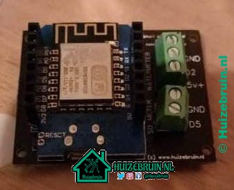

| Repository Status | ESPHome S0tool discord Community |
| :--- | :--- |
| [![last commit time][github-last-commit]][github-master] [![GitHub Activity][commits-shield]][commits] | [![Discord][discord-shield]][discord]  | 


 


## Installatie: 
1. Installeer Home Assistant & Esphome .
2. connect de wemos d1 mini aan een usblader.
3. ga met je laptop of telefoon naar     <b>ssid:</b> ```S0-Meter Fallback Hotspot``` &   <b> password:</b> ```s0watermeter```
4. ga naar ```192.168.4.1```.
5. zet de juiste SSID en Wachtwoord in de velden
6. wacht tot hij klaar is, en dan geeft hij het adres aan waar hij op te vinden iss ( zet die vast in je router)
7. ga naar je home assistant instalatie, deze zal gaan melden dat er een nieuw device gekoppeld zal zijn. en voeg deze toe.
8. als het goed is gaat de print connectie maken met github om de laatste versie binnen te halen en daardoor ook toe te voegen aan esphome
9. zet het ipadres vast in je router en in de config file binnen esphome. lees de info regels bij de wifi info.
```  dit zijn de hekjes voor de regels 27,28,31,33,35. En plaatst een # voor regel 23 ( doe je deze laatste niet dan komt hij weer online na een reboot of update naar 192.168.4.1 ```
10. voeg de volgende code toe aan je ``` configuration.yaml   ```  ``` utility_meter: !include utility_meter/utility.yaml ```
11. maak een map aan in je config map via de verkenner en noem deze ``` utiliy_meter ``` en plaats daar weer een tekst bestand in en hernoem deze naar utility.yaml en voeg onderstaande code daar in en sla deze op( of download hem uit deze repro) en plaats hem in die map.

```
#utility_meter:
### watermeter  S0 meter
  waterverbruik_kwartier:
    source: sensor.watermeter_totaal
    cycle: quarter-hourly
  waterverbruik_per_uur:
    source: sensor.watermeter_totaal
    cycle: hourly
  waterverbruik_per_dag:
    source: sensor.watermeter_totaal
    cycle: daily    
  waterverbruik_per_week:
    source: sensor.watermeter_totaal
    cycle: weekly
  waterverbruik_per_maand:
    source: sensor.watermeter_totaal
    cycle: monthly
  waterverbruik_per_kwartaal:
    source: sensor.watermeter_totaal
    cycle: quarterly
  waterverbruik_per_jaar:
    source: sensor.watermeter_totaal
    cycle: yearly   
### zonnepanelen S0 meter
  zonnepanelen_kwartier:
    source: sensor.actuele_vermogen
    cycle: quarter-hourly
  zonnepanelen_per_uur:
    source: sensor.actuele_vermogen
    cycle: hourly
  zonnepanelen_per_dag:
    source: sensor.actuele_vermogen
    cycle: daily
  zonnepanelen_per_week:
    source: sensor.actuele_vermogen
    cycle: weekly
  zonnepanelen_per_maand:
    source: sensor.actuele_vermogen
    cycle: monthly 
  zonnepanelen_per_kwartaal:
    source: sensor.actuele_vermogen
    cycle: quarterly
  zonnepanelen_per_jaar:
    source: sensor.actuele_vermogen
    cycle: yearly   
```

12. Restart Home Assistant one final time.


[commits-shield]: https://img.shields.io/github/commit-activity/m/huizebruin/s0tool.svg
[commits]: https://github.com/huizebruin/s0tool/commits/main
[github-last-commit]: https://img.shields.io/github/last-commit/huizebruin/s0tool.svg?style=plasticr
[github-master]: https://github.com/huizebruin/s0tool/commits/main

[discord-shield]: https://img.shields.io/discord/723629686093119650.svg?logo=discord&color=7289da
[discord]: https://discord.gg/bN8rC7gEng

