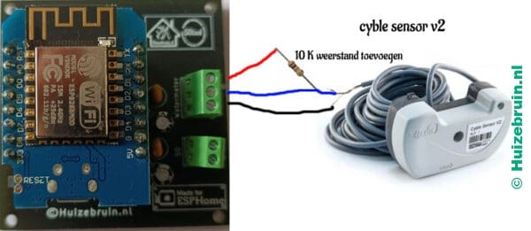
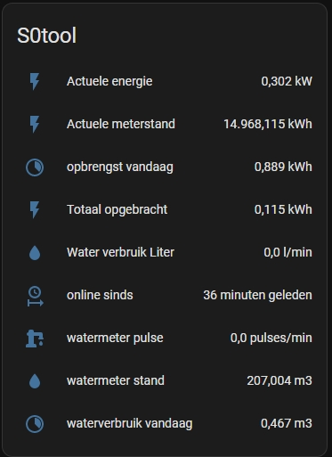
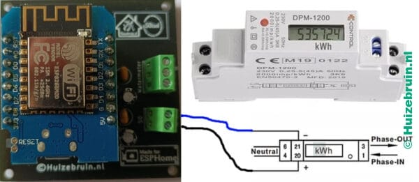

| Repository Status | ESPHome S0tool discord Community |
| :--- | :--- |
| [![last commit time][github-last-commit]][github-master] [![GitHub Activity][commits-shield]][commits] | [![Discord][discord-shield]][discord]  [](https://esphome.io)
|  [![License][license-shield]](LICENSE) [![Forks][forks-shield]][forks-url] [![Stargazers][stars-shield]][stars-url] [![Issues][issues-shield]][issues-url]  | [![Contributors][contributors-shield]][contributors-url] [](https://GitHub.com/huizebruin/s0tool/releases/)| 


|  S0tool.nl | 
| :--- | 
|   |
| Made for ESPHome program |
|  |

|  S0tool | Dashboard  |
| :--- | :--- |
|    |  |

## New website for the S0tool. (24-06-2024)

For more information check also  [https://s0tool.nl](https://s0tool.nl)

## Dutch version
For the Dutch version look on my [website](https://www.huizebruin.nl/home-assistant/wat-is-de-s0tool/) 
 
<br><br>
# How to order the <b>S0tool</b> ?
[https://www.huizebruin.nl/shop](https://www.huizebruin.nl/shop)</br>
At this moment we only ship to : The Netherlands and België 

## If u cannot buy it u can make it on your own.
You need a couple of thinks<br>
and place a resistor between the D2 and 5V.

Wemos D1 mini ep8266 [Aliexpres](https://s.click.aliexpress.com/e/_9fhHxf) or [Amazon](https://amzn.to/3FL7O48) or dutch webshop [Opencircuit](https://opencircuit.nl/Product/WeMos-D1-mini-V3.1-Wifi-Module?affiliate=1VL4KIAMBZ&cid=github)<br>

Npn Sensor [Aliexpres](https://s.click.aliexpress.com/e/_AVaoGr) or [Amazon](https://amzn.to/3DFVsaL) or dutch webshop [Opencircuit](https://opencircuit.nl/product/lj18a3-8-z-bx-5v-nabijheids-sensor-n-o-npn-8mm?affiliate=1VL4KIAMBZ&cid=github)<br>

10K resistor [Aliexpres](https://s.click.aliexpress.com/e/_A10BHz) or [Amazon](https://amzn.to/3NBjjx2) or dutch webshop [Opencircuit](https://opencircuit.nl/Product/10K%CE%A9-Metaalfilm-weerstand-1-4W-10-stuks?affiliate=1VL4KIAMBZ&cid=github)<br>

And a usb cable and minimal a usb power adapter with 5v and 1A


Will it work with my meter check it out here. https://github.com/huizebruin/s0tool/discussions/57<br>


<br>
Before update of the S0tool u should use, and above <br>

| Program | version |
| :------------- | :--------- |
| Home Assistant | v 2024.6.0 |
| ESPHome | v 2024.6.0 |

<br>

## Information:<br>
  Wi-fi : IEEE 802.11 b/g/n 2.4GHz 

<br>

***
<br>

### Software update information at [releases](https://github.com/huizebruin/s0tool/releases) here on Github.
***

# Hardware
Put the sensors ad your 🛒 Look what you need te have te use it.
#
## 5V Power and cable
- Minimal a 5v 1A [Bol.com](https://partner.bol.com/click/click?p=2&t=url&s=1097464&f=TXL&url=https%3A%2F%2Fwww.bol.com%2Fnl%2Fnl%2Fp%2Funiversal-usb-adapter-usb-stekker-usb-lader-blokje-universeel-zwart%2F9300000030638594%2F&name=Universal%20USB%20adapter%20-%20USB%20stekker%20-%20USB%20lader) 
- usb kabel [Bol.com](https://partner.bol.com/click/click?p=2&t=url&s=1097464&f=TXL&url=https%3A%2F%2Fwww.bol.com%2Fnl%2Fnl%2Fp%2Fzware-kwaliteit-0-3-m-usb-oplaadkabel-oplaadsnoer-kabel-voor-snelladen-past-ook-op-huawei-ascend-3-ideos-x3-mate-10-lite-mate-8-mate-s-p-smart-p10-lite-p8-lite%2F9200000124489693%2F&name=Zware%20kwaliteit%200%2C3%20m%20USB%20oplaadkabel.%20) or [opencircuit.nl](https://opencircuit.nl/product/Micro-USB-kabel-100cm-blauw-30AWG?affiliate=1VL4KIAMBZ)

Or a 5v 2.5A with cable [Opencircuit.nl](https://opencircuit.nl/product/5V-2.5A-Adapter-Micro-USB-B-Raspberry-Pi?affiliate=1VL4KIAMBZ&cid=github) or at [Bol.com](https://partner.bol.com/click/click?p=2&t=url&s=1097464&f=TXL&url=https%3A%2F%2Fwww.bol.com%2Fnl%2Fnl%2Fp%2Fxssive-usb-lader-met-micro-usb-kabel-voor-motorola-smartphones-o-a-moto-x-moto-g-moto-e-nexus-6%2F9200000055360796%2F&name=Xssive%20USB%20Lader%20met%20Micro%20USB%20Kabel%20).
#
## For the  water counter
-  a NPN sensor - [Aliexpress](https://s.click.aliexpress.com/e/_AaxBxa) or [Aliexpress](https://s.click.aliexpress.com/e/_ADG3ri) or [Aliexpress](https://s.click.aliexpress.com/e/_A4Lsko) or in Nederland at [Opencircuit.nl](https://opencircuit.nl/product/lj18a3-8-z-bx-5v-nabijheids-sensor-n-o-npn-8mm?affiliate=1VL4KIAMBZ&cid=github)
- (use npn sensor for 5V not that one thats higher than 6V !!)<br> 
I am using the LJ18A3-8-Z/BX-5V <br> <br>

NPN sensor to the S0tool<br>
<br>

Cyble sensor V2 to the S0tool<br>
<br>
Here u must add a 10K Ohm resistor between the GND and D2

Soon also a sensor for  Elster V100	kogelvorm meter for the S0tool at my shop.

For More information about the S0tool look at my [Website](https://www.huizebruin.nl/home-assistant/wat-is-de-s0tool/).

## Watermeter to energy dashboard.
From Home Assistant version 2022.11.X it is possible to add the water meter to the energy dashboard with the S0tool from version v22.10.20.<br>
|  Enegry dashboard | Dashboard  |
| :--- | :--- |
|    |  |

***
## For keeping track of solar panels or heat pump etc.
- 45A kWh meter with 1000 pulses at kWh [Bol.com](https://partner.bol.com/click/click?p=2&t=url&s=1097464&f=TXL&url=https%3A%2F%2Fwww.bol.com%2Fnl%2Fnl%2Fp%2Fsdm120d-mid-1-fase-kwh-meter-met-puls-uitgang%2F9200000112029366%2F&name=SDM120D%20MID%20-%201%20Fase%20kWh%20meter%20met%20puls%20uitgang)
- 40A kWh meter with 2000 pulses at kWh [Bol.com](https://partner.bol.com/click/click?p=2&t=url&s=1097464&f=TXL&url=https%3A%2F%2Fwww.bol.com%2Fnl%2Fnl%2Fp%2Felektronische-wattmeter-greenblue-gb173-voor-zowel-prive-als-handel-industrie%2F9200000115897616%2F&name=Elektronische%20wattmeter%20GreenBlue%20GB173) <br>
- 32A kWh meter with 2000 pulses at kWh [Amazon](https://amzn.to/3P6CSg0)
- 40A kWh meter with 1000 pulses at kWh [Amazon](https://amzn.to/3oV08ms)

2000 pulses per kWh are given. This means that each plus has a value of 1/2000 = 0.0005 kWh
1000 pulses per kWh are given. This means that each plus has a value of 1/1000 = 0.001 kWh

2000 imp/kWh : gives 2,000 impulses per kWh. is therefore more accurate to do a measurement than the 1000 imp/KWh
The more energy you consume or supply back, the faster it will switch.<br>


<br>
#
## The s0 connection <br>
<br>
How to put it to your setup<br>
<br>

***
<br>

## Installation: 

First you must have installed the CH340 drivers for the wemos d1 to communicate to your pc / laptop .<br>

Go to this link to install the drivers ch340. 
[https://sparks.gogo.co.nz/ch340.html](https://sparks.gogo.co.nz/ch340.html) <br>

06/05/2022: <br> Now also possible to flash the <b>s0tool</b> directly via the browser.<br>
Only possible with a chrome or edge and opera browser. <br>
Connect the s0tool to your PC/laptop with a USB cable and start the procedure.
 [https://s0tool.nl](https://s0tool.nl)

1. Install Home Assistant & Esphome .
2. Connect the wemos d1 mini to a USB charger.
3. Go to <b>ssid:</b> ```S0tool``` 
4. Go to ```192.168.4.1```.
5. Put the correct SSID and Password in the fields
6. Wait until it is ready, and then it will indicate the address where it can be found (put it in your router)
7. Go to your Home Assistant installation, it will report that a new device has been connected. And add this.
8. If all goes well, the print will connect to Github to download the latest version, and thereby also add it to Esphome
9. Create a folder in your config folder via explorer and name it ``` utility_meter ``` and put another text file in it and rename it to utility.yaml, and add the code below. And save it (or download it from this repro) and put it in that folder. (Code that is under 10)
10. Add the following code to your
``` configuration.yaml ```
<br> ``` utility_meter: !include utility_meter/utility.yaml ```

``` yaml
#utility_meter:
### watermeter  S0 meter
  waterverbruik_kwartier:
    source: sensor.watermeter_totaal
    cycle: quarter-hourly
  waterverbruik_per_uur:
    source: sensor.watermeter_totaal
    cycle: hourly
enz...
```
Those in the file are in the folder [utility_meter/utility.yaml](https://github.com/huizebruin/s0tool/blob/main/utility_meter/utility.yaml) 

12. Optionally to see if there are new updates, you can create the following Line in your configuration.yaml:<br>
```yaml
homeassistant:
  packages: !include_dir_merge_named packages/
  ```
And make a folder in youre comfig map on Home Asstant ```packages``` and make there a file like ```s0tool.yaml``` and ad there the code from the file from the [package map on the s0tool github](https://github.com/huizebruin/s0tool/tree/main/packages)
(or you copy the package dutch or English file from the package folder and put it all in your own configuration).
```yaml
#sensor: # get away if this is your first sensor
  - platform: rest
    resource: https://api.github.com/repos/huizebruin/s0tool/releases/latest
    name: s0tool_version_github
    unique_id: s0tool_github_version
    value_template: '{{ value_json.tag_name }}'
    scan_interval: 3600

  template:
      - binary_sensor:
          - name: "s0Tool update online"
            unique_id: s0tool_up_to_date
            state: >
              
              
              {{ version(a) > version(b) }}
            device_class: update

```

13. Restart Home Assistant one more time to add everything to your Lovelace screen.

14. Add this card to automatically get an update on your dashboard, so you know if you are using the latest version.

``` yaml
type: conditional
conditions:
  - entity: sensor.s0tool_up_to_date
    state_not: 'True'
card:
  type: markdown
  content: The s0tool is not up to date with the GitHub version.
```
***


## Blueprint for update notifications.
With this you can create an automation that will notify you when a new version is online on Github.
You must have added all the above sensors.
<br>
[](https://my.home-assistant.io/redirect/blueprint_import/?blueprint_url=https%3A%2F%2Fgist.github.com%2Fhuizebruin%2Fcc87171b7974517497fbb55cd4bef83e)


***
## Adjusting the meter reading

[](https://my.home-assistant.io/redirect/developer_call_service/?service=ESPHome%3A+s0tool_meterstand_water) To adjust the water meter position.
<br>
 [](https://my.home-assistant.io/redirect/developer_call_service/?service=ESPHome%3A+s0tool_meterstand_kwh) To adjust your kWh meter reading
<br>
Or this option and then search for the right meter and then adjust, <br> 
[](https://my.home-assistant.io/redirect/developer_call_service/?service=Nutsmeter%3A+Calibrate) here you can update all meter readings
<br>

****
## Update function

This can be done by the ESPHome dashboard by now.
***

Have fun with this tool.<br>
Any additions / improvements <br> may be made via <b>[Pull requests](https://github.com/huizebruin/s0tool/pulls)</b> be supplemented.<br> 
Or via<b> [issues](https://github.com/huizebruin/s0tool/issues) </b> requested or added.
<br><br><br><b>
Wobbe </b><br>
From <a href="https://www.Huizebruin.nl" rel="noreferer, ,noopener" target="_blank">Huizebruin.nl</a> & <a href="https://s0tool.nl" rel="noreferer, ,noopener" target="_blank">S0tool.nl</a>

Do you like my work ?  [](https://paypal.me/huizebruin) <br>
[](https://ko-fi.com/W7W4QU9ZX)
<br><br>
For more information and connection diagrams, etc., take a look at the [website](https://www.huizebruin.nl/home-assistant/wat-is-de-s0tool/).
***

## To cooperate. 
This is an active open source project. <br>
We are always open to people who want to use or contribute to the code. 

Who else is working on this project : <br>
<br>

****

<h2 id="troubleshooting">Troubleshooting</h2>

<h3 id="drivers">USB Serial Drivers</h3>
<p>
  If the serial port is not showing up, your computer might be missing the
  drivers for the USB serial chip used in your ESP device. These drivers
  work for most ESP devices:
</p>
  <ul>
  <li>
    CP2102 (square chip):
    <a href="https://www.silabs.com/products/development-tools/software/usb-to-uart-bridge-vcp-drivers" rel="noreferer, ,noopener" target="_blank">driver</a>
  </li>
  <li>
    CH341:
    <a href="https://github.com/nodemcu/nodemcu-devkit/tree/master/Drivers" rel="noreferer, ,noopener" target="_blank">driver</a>
  </li>
  <li>
    CH340:
    <a href="https://sparks.gogo.co.nz/ch340.html" rel="noreferer, ,noopener" target="_blank">driver</a>
  </li>
  </ul>
<br>


## License
<div style="text-align:left;font-size:14px;">

MIT License

Copyright (c) 2021 / 2024 Huizebruin.nl / s0tool.nl

Permission is hereby granted, free of charge, to any person obtaining a copy of this software and associated documentation files (the "Software"), to deal in the Software without restriction, including without limitation the rights to use, copy, modify, merge, publish, distribute, sublicense, and/or sell copies of the Software, and to permit persons to whom the Software is furnished to do so, subject to the following conditions:

The above copyright notice and this permission notice shall be included in all copies or substantial portions of the Software.

THE SOFTWARE IS PROVIDED "AS IS", WITHOUT WARRANTY OF ANY KIND, EXPRESS OR IMPLIED, INCLUDING BUT NOT LIMITED TO THE WARRANTIES OF MERCHANTABILITY, FITNESS FOR A PARTICULAR PURPOSE AND NONINFRINGEMENT. IN NO EVENT SHALL THE AUTHORS OR COPYRIGHT HOLDERS BE LIABLE FOR ANY CLAIM, DAMAGES OR OTHER LIABILITY, WHETHER IN AN ACTION OF CONTRACT, TORT OR OTHERWISE, ARISING FROM, OUT OF OR IN CONNECTION WITH THE SOFTWARE OR THE USE OR OTHER DEALINGS IN THE SOFTWARE.
</div>

***

<a href="https://tc.tradetracker.net/?c=27&amp;m=39668&amp;a=385034&amp;r=&amp;u=" target="_blank" rel="sponsored nofollow">Make money with your site. Start now, sign up here.</a>
<div style="text-align:center;font-size:13px;">
      <hr>
      <a href="https://esphome.github.io/esp-web-tools/" target="_blank" style="color:#aaa;">S0tool Installer powered by ESP Web Tools</a>
    </div>


[commits-shield]: https://img.shields.io/github/commit-activity/m/huizebruin/s0tool.svg
[commits]: https://github.com/huizebruin/s0tool/commits/main
[github-last-commit]: https://img.shields.io/github/last-commit/huizebruin/s0tool.svg?style=plasticr
[github-master]: https://github.com/huizebruin/s0tool/commits/main
[license-shield]: https://img.shields.io/github/license/huizebruin/s0tool.svg
[discord-shield]: https://img.shields.io/discord/723629686093119650.svg?logo=discord&color=7289da
[discord]: https://discord.gg/bN8rC7gEng
[contributors-url]: https://github.com/huizebruin/s0tool/graphs/contributors
[contributors-shield]: https://img.shields.io/github/contributors/huizebruin/s0tool.svg
[forks-shield]: https://img.shields.io/github/forks/huizebruin/s0tool.svg
[forks-url]: https://github.com/huizebruin/s0tool/network/members
[stars-shield]: https://img.shields.io/github/stars/huizebruin/s0tool.svg
[stars-url]: https://github.com/huizebruin/s0tool/stargazers
[issues-shield]: https://img.shields.io/github/issues/huizebruin/s0tool.svg
[issues-url]: https://github.com/huizebruin/s0tool/issues

