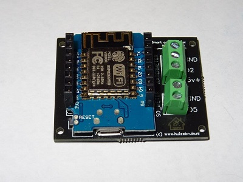
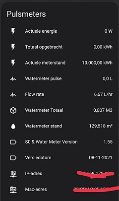
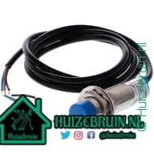
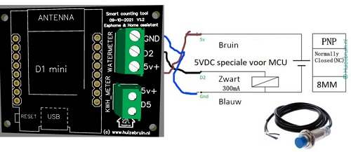
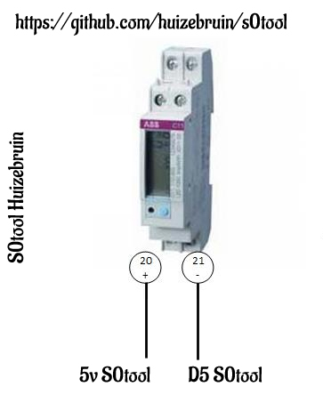

| Repository Status | ESPHome S0tool discord Community |
| :--- | :--- |
| [![last commit time][github-last-commit]][github-master] [![GitHub Activity][commits-shield]][commits] | [![Discord][discord-shield]][discord]  
|  [![License][license-shield]](LICENSE) [![Forks][forks-shield]][forks-url] [![Stargazers][stars-shield]][stars-url] [![Issues][issues-shield]][issues-url] | [![Contributors][contributors-shield]][contributors-url] [](https://GitHub.com/huizebruin/s0tool/releases/)| 


 

 
<br><br>
# De s0tool bestellen?
https://www.huizebruin.nl/s0tool-bestellen/<br>
Ik heb nog een aantal pcb's welke ik kan gaan klaar maken voor verkoop.<br>
En mocht er meer vraag naar zijn ga ik nieuwe printen bestellen.

In <b>v1</b> zit een klein foutje in bij de s0 aansluiting zit de gnd.<br> Dat werkt niet, is een ontwerpfoutje dus dan moet er een kabeltje vanaf de 5v poort 20 op je kwh meter met de s0 poort ( bij de watermeter aansluiting) en de andere op de D5 waar s0 poort bij staat dat is de aansluiting 21 op je kwh meter met s0 poort.

***

### Software update informatie zie de [releases](https://github.com/huizebruin/s0tool/releases) sectie op github.
***

# Hardware
Vul eerst uw  🛒 of kijk of je de onderstaande componenten al hebt .
## Voor de watermeter
- NPN sensor - [Aliexpress](https://s.click.aliexpress.com/e/_AaxBxa) of [Aliexpress](https://s.click.aliexpress.com/e/_ADG3ri) of [Aliexpress](https://s.click.aliexpress.com/e/_A4Lsko) 
- (Zorg ervoor dat het sensoren voor 5V zijn niet 6V of hoger!!) Ik gebruik zelf de LJ18A3-8-Z/BX-5V <br> <br><br>
***
## Voor het bijhouden van zonnepanelen of warmtepomp etc.
- kwh meter met 1000 pulsen per kwh [bol.com](https://partner.bol.com/click/click?p=2&t=url&s=1097464&f=TXL&url=https%3A%2F%2Fwww.bol.com%2Fnl%2Fnl%2Fp%2Fsdm120d-mid-1-fase-kwh-meter-met-puls-uitgang%2F9200000112029366%2F&name=SDM120D%20MID%20-%201%20Fase%20kWh%20meter%20met%20puls%20uitgang)
- kwh meter met 2000 pulsen per kwh [bol.com](https://partner.bol.com/click/click?p=2&t=url&s=1097464&f=TXL&url=https%3A%2F%2Fwww.bol.com%2Fnl%2Fnl%2Fp%2Felektronische-wattmeter-greenblue-gb173-voor-zowel-prive-als-handel-industrie%2F9200000115897616%2F&name=Elektronische%20wattmeter%20GreenBlue%20GB173) <br>
<br>
## De s0 aansluiting <br>
<br>
Op versie 1 van de print moet je de draad vanaf de 5V bij de watermeter pakken naar poort 20 op je meter. (versie 2 van de print is dit verholpen en zit er 5v aansluiting naast de D5 aansluiting) <br> En vanaf poort 21 ga je naar D5 op de s0tool.
***
<br>

## Installatie: 

1. Installeer Home Assistant & Esphome .
2. Connect de wemos d1 mini aan een usblader.
3. Ga met je laptop of telefoon naar     <b>ssid:</b> ```S0tool``` &   <b> password:</b> ```s0watermeter```
4. Ga naar ```192.168.4.1```.
5. Zet de juiste SSID en Wachtwoord in de velden
6. Wacht tot hij klaar is, en dan geeft hij het adres aan waar hij op te vinden iss ( zet die vast in je router)
7. Ga naar je home assistant instalatie, deze zal gaan melden dat er een nieuw device gekoppeld zal zijn. en voeg deze toe.
8. Als het goed is gaat de print connectie maken met github om de laatste versie binnen te halen en daardoor ook toe te voegen aan esphome
9. Voeg de volgende code toe aan je 
``` configuration.yaml   ```
<br> ``` utility_meter: !include utility_meter/utility.yaml ```
10. Maak een map aan in je config map via de verkenner en noem deze ``` utiliy_meter ``` en plaats daar weer een tekst bestand in en hernoem deze naar utility.yaml en voeg onderstaande code daar in en sla deze op( of download hem uit deze repro) en plaats hem in die map.

``` yaml
#utility_meter:
### watermeter  S0 meter
  waterverbruik_kwartier:
    source: sensor.watermeter_totaal
    cycle: quarter-hourly
  waterverbruik_per_uur:
    source: sensor.watermeter_totaal
    cycle: hourly
enz...
Die in de file staan in de map utility_meter/utility.yaml  
```
12. Optioneel om te zien of er nieuwe updates zijn, kun je de volgende sensor aanmaken in je configuration.yaml:<br>
(of je kopieert de sensor file uit de sensor map en plaatst dat allemaal in je eigen configuratie).
```yaml
#sensor: # ervoor weg als dit je eerste sensor is
  - platform: rest
    resource: https://api.github.com/repos/huizebruin/s0tool/releases/latest
    name: s0tool_versie_github
    value_template: '​{{ value_json.tag_name }}​'

```
Deze versie kun je dan vergelijken met de entity "sensor.s0tool_versie".<br>
Deze 2 staan ook in de sensor map op deze github.

13. Herstart Home Assistant nog een maal om alles toe te kunnen voegen aan je lovelace scherm.

14. Voeg deze kaart toe om automatisch een update te krijgen op je dashboard daarmee weet je of je de laatste versie gebruikt.

``` yaml
type: conditional
conditions:
  - entity: sensor.s0tool_gelijk_github
    state_not: 'True'
card:
  type: markdown
  content: De s0tool is niet up to date met de GitHub versie.
```
Veel plezier met deze tool.<br>
eventuweel toevoegingen / verbeteringen mogen via Pull requests aangevuld worden.

Wobbe van Huizebruin.nl
***

## Meewerken.
Dit is een actief open-sourceproject. <br>
We staan ​​altijd open voor mensen die de code willen gebruiken of eraan willen bijdragen.

We hebben een apart [document](​Contributing.md) opgesteld voor onze richtlijnen voor bijdragen.

Bedankt voor het meedoen <br>
Wie werken er nog meer aan dit project :<br>
<br>
****

## License

MIT License

Copyright (c) 2021 / 2022 Huizebruin

Permission is hereby granted, free of charge, to any person obtaining a copy of this software and associated documentation files (the "Software"), to deal in the Software without restriction, including without limitation the rights to use, copy, modify, merge, publish, distribute, sublicense, and/or sell copies of the Software, and to permit persons to whom the Software is furnished to do so, subject to the following conditions:

The above copyright notice and this permission notice shall be included in all copies or substantial portions of the Software.

THE SOFTWARE IS PROVIDED "AS IS", WITHOUT WARRANTY OF ANY KIND, EXPRESS OR IMPLIED, INCLUDING BUT NOT LIMITED TO THE WARRANTIES OF MERCHANTABILITY, FITNESS FOR A PARTICULAR PURPOSE AND NONINFRINGEMENT. IN NO EVENT SHALL THE AUTHORS OR COPYRIGHT HOLDERS BE LIABLE FOR ANY CLAIM, DAMAGES OR OTHER LIABILITY, WHETHER IN AN ACTION OF CONTRACT, TORT OR OTHERWISE, ARISING FROM, OUT OF OR IN CONNECTION WITH THE SOFTWARE OR THE USE OR OTHER DEALINGS IN THE SOFTWARE.

***

<a href="https://tc.tradetracker.net/?c=27&amp;m=39668&amp;a=385034&amp;r=&amp;u=" target="_blank" rel="sponsored nofollow">Geld verdienen met je site. Start nu, meldt je hier aan.</a>


[commits-shield]: https://img.shields.io/github/commit-activity/m/huizebruin/s0tool.svg
[commits]: https://github.com/huizebruin/s0tool/commits/main
[github-last-commit]: https://img.shields.io/github/last-commit/huizebruin/s0tool.svg?style=plasticr
[github-master]: https://github.com/huizebruin/s0tool/commits/main
[license-shield]: https://img.shields.io/github/license/huizebruin/s0tool.svg
[discord-shield]: https://img.shields.io/discord/723629686093119650.svg?logo=discord&color=7289da
[discord]: https://discord.gg/bN8rC7gEng
[contributors-url]: https://github.com/huizebruin/s0tool/graphs/contributors
[contributors-shield]: https://img.shields.io/github/contributors/huizebruin/s0tool.svg
[forks-shield]: https://img.shields.io/github/forks/huizebruin/s0tool.svg
[forks-url]: https://github.com/huizebruin/s0tool/network/members
[stars-shield]: https://img.shields.io/github/stars/huizebruin/s0tool.svg
[stars-url]: https://github.com/huizebruin/s0tool/stargazers
[issues-shield]: https://img.shields.io/github/issues/huizebruin/s0tool.svg
[issues-url]: https://github.com/huizebruin/s0tool/issues
