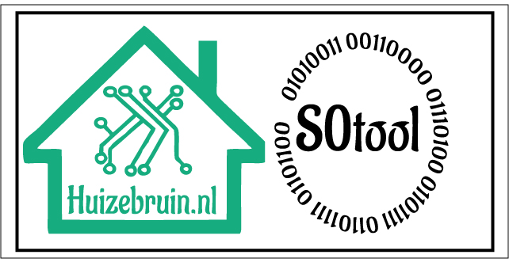

| Repository Status | ESPHome S0tool discord Community |
| :--- | :--- |
| [![last commit time][github-last-commit]][github-master] [![GitHub Activity][commits-shield]][commits] | [![Discord][discord-shield]][discord]  
|  [![License][license-shield]](LICENSE) [![Forks][forks-shield]][forks-url] [![Stargazers][stars-shield]][stars-url] [![Issues][issues-shield]][issues-url] | [![Contributors][contributors-shield]][contributors-url] | 

# S0tool

  

S0tool makes a *(not so)* kwh meter with a s0 port a smart meter, reading the pulse thats from the S0 port that is always present in most cases and it works with [ESPHome][esphome]!  
a case has been designed that you can 3D print yourself.

## Installation

You can use the button below to install the home assistant glow firmware directly to your device via USB from the browser.

<esp-web-install-button manifest="./manifest.json"></esp-web-install-button>

[esphome]: https://esphome.io/

[commits-shield]: https://img.shields.io/github/commit-activity/m/huizebruin/s0tool.svg
[commits]: https://github.com/huizebruin/s0tool/commits/main
[github-last-commit]: https://img.shields.io/github/last-commit/huizebruin/s0tool.svg?style=plasticr
[github-master]: https://github.com/huizebruin/s0tool/commits/main
[license-shield]: https://img.shields.io/github/license/huizebruin/s0tool.svg
[discord-shield]: https://img.shields.io/discord/723629686093119650.svg?logo=discord&color=7289da
[discord]: https://discord.gg/bN8rC7gEng
[contributors-url]: https://github.com/huizebruin/s0tool/graphs/contributors
[contributors-shield]: https://img.shields.io/github/contributors/huizebruin/s0tool.svg
[forks-shield]: https://img.shields.io/github/forks/huizebruin/s0tool.svg
[forks-url]: https://github.com/huizebruin/s0tool/network/members
[stars-shield]: https://img.shields.io/github/stars/huizebruin/s0tool.svg
[stars-url]: https://github.com/huizebruin/s0tool/stargazers
[issues-shield]: https://img.shields.io/github/issues/huizebruin/s0tool.svg
[issues-url]: https://github.com/huizebruin/s0tool/issues