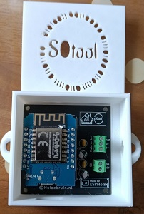
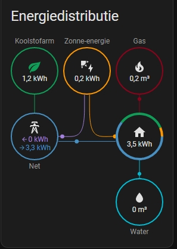
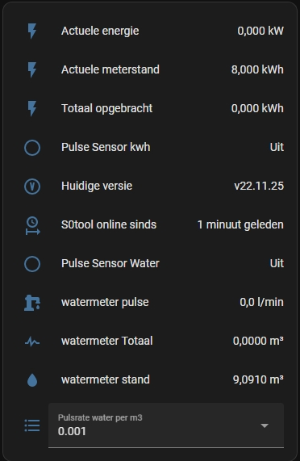

| Repository Status | ESPHome S0tool discord Community |
| :----- | :----- |
| [![last commit time][github-last-commit]][github-master] [![GitHub Activity][commits-shield]][commits] | [![Discord][discord-shield]][discord]  
|  [![License][license-shield]](LICENSE) [![Forks][forks-shield]][forks-url] [![Stargazers][stars-shield]][stars-url] [![Issues][issues-shield]][issues-url] | [![Contributors][contributors-shield]][contributors-url] | 

# S0tool

|  S0tool | Made for ESPHome program  |
| :--- | :--- |
|    |  |

 
With the<b> S0tool</b> you can keep track of the consumption of both your water meter and a kWh meter that has an S0 connection.

The tool is ideal for keeping track of the consumption of devices such as heat pumps, or the yield of your solar panels.
A suitable kWh meter with an S0 connection must be installed for this.

<b>S0tool</b> makes a *(not so)* kwh meter with a s0 port a smart meter, reading the pulse thats from the S0 port that is always present in most cases and it works with [ESPHome][esphome]!  And has a official Made for ESPHome license  

 

## If u cannot buy it u can make it on your own.
You need a couple of thinks 
and place a resistor between the D2 and 5V.

Wemos D1 mini ep8266 [Aliexpres](https://s.click.aliexpress.com/e/_9fhHxf) or [Amazon](https://amzn.to/3FL7O48) or dutch webshop [Opencircuit](https://opencircuit.nl/Product/WeMos-D1-mini-V3.1-Wifi-Module?affiliate=1VL4KIAMBZ&cid=github) 

Npn Sensor [Aliexpres](https://s.click.aliexpress.com/e/_AVaoGr) or [Amazon](https://amzn.to/3DFVsaL) or dutch webshop [Opencircuit](https://opencircuit.nl/product/lj18a3-8-z-bx-5v-nabijheids-sensor-n-o-npn-8mm?affiliate=1VL4KIAMBZ&cid=github) 

10K resistor [Aliexpres](https://s.click.aliexpress.com/e/_A10BHz) or [Amazon](https://amzn.to/3NBjjx2) or dutch webshop [Opencircuit](https://opencircuit.nl/Product/10K%CE%A9-Metaalfilm-weerstand-1-4W-10-stuks?affiliate=1VL4KIAMBZ&cid=github) 

And a usb cable and minimal a usb power adapter with 5v and 1A

Will it work with my meter check it out here. [https://github.com/huizebruin/s0tool/discussions/57](https://github.com/huizebruin/s0tool/discussions/57)

## Information:
 
  Wi-fi : IEEE 802.11 b/g/n 2.4GHz 

 

## Watermeter to energy dashboard.
From Home Assistant version 2022.11.X it is possible to add the water meter to the energy dashboard with the S0tool from version v22.10.20. 

|  Enegry dashboard | Dashboard  |
| :----------- | :------- |
|   |  |

 

## Installation

First you must have installed the drivers for the Wemos d1 to communicate to your pc / laptop . Look at Troubleshooting below.  

And you must connect the S0tool to your pc of laptop with a cable witch have power and data lines .

You can use the button below to install the <b>S0tool</b> firmware directly to your device via USB from the browser.  
<b>Works only for a Wemos d1 mini V1 esp8266 at this moment.</b> 
Wi-fi: IEEE 802.11 b/g/n 2.4GHz   

|  S0tool version | Install | Info | Pin |
| :------ | :----- | :------- | :------- |
|Standard | <esp-web-install-button manifest="./s0tool-standard-manifest.json"></esp-web-install-button> |Standard with watermeter and kWh meter |D2 & D5 |
|S0tool Watermeter | <esp-web-install-button manifest="./s0tool-watermeter-manifest.json"></esp-web-install-button>|Only watermeter |D2 |
|S0tool kWh meter| <esp-web-install-button manifest="./s0tool-kwh-puls-manifest.json"></esp-web-install-button>|Only kWh meter |D5 |
|Specials|  |  |  |
|S0tool dsz12d| <esp-web-install-button manifest="./s0tool-dsz12d-manifest.json"></esp-web-install-button>|special for the dsz12d |D5 |
|S0tool lem022sj| <esp-web-install-button manifest="./s0tool-lem022sj-manifest.json"></esp-web-install-button>|special for the lem022sj 400imp |D5 |    
|S0tool s0-watermeter| <esp-web-install-button manifest="./s0tool-s0-watermeter-manifest.json"><esp-web-install-button>|special for the s0-watermeter |D2 |
|S0tool flux and puls| <esp-web-install-button manifest="./s0tool-fluxandpuls-manifest.json"></esp-web-install-button>|special for flow sensor and puls sensor |D2 | 

***
Its possible now te adjust the kWh puls rate settings from Home Assistant dashboard an it stays on your setting with reboot and by the update's   The combinations are possible between 10 and 4000 puls/kWh with steps by 10.
***

## Special versions . 
Only needed if the kWh counter has a impulslengte other than between the 50 an 100ms on the datasheet. 

***

## How to change the total readings
  For the water counter: D2
 
   For the S0 port of the kwh meter : D5
 

And you can find your readings and reset it. 

***

<h2 id="troubleshooting">Troubleshooting</h2>

<h3 id="drivers">USB Serial Drivers</h3>

  If the serial port is not showing up, your computer might be missing the
  drivers for the USB serial chip used in your ESP device. These drivers
  work for most ESP devices:

  <ul>
  <li>
    CP2102 (square chip):
    <a href="https://www.silabs.com/products/development-tools/software/usb-to-uart-bridge-vcp-drivers" rel="noreferer, ,noopener" target="_blank">driver</a>
  </li>
  <li>
    CH341:
    <a href="https://github.com/nodemcu/nodemcu-devkit/tree/master/Drivers" rel="noreferer, ,noopener" target="_blank">driver</a>
  </li>
  <li>
    CH340:
    <a href="https://sparks.gogo.co.nz/ch340.html" rel="noreferer, ,noopener" target="_blank">driver</a>
  </li>
  </ul>
 
For problems or solutions <b>[Pull requests](https://github.com/huizebruin/s0tool/pulls)</b>.  
For problems <b>[issues](https://github.com/huizebruin/s0tool/issues) . </b>
  

Have fun with the <b>S0tool</b>.
  <b>
Wobbe </b> 
From Huizebruin.nl

Do you like my work ?    

  
For more information about the code etc.
https://github.com/huizebruin/s0tool
 
For more information about the S0tool look at my (Dutch) [website](https://www.huizebruin.nl/home-assistant/wat-is-de-s0tool/).

## Contributing
If you'd like to contribute to the s0tool project, please fork the repository and submit a pull request. We welcome contributions of all kinds, including bug fixes, new features, and documentation updates.

## License
MIT License
Permission is hereby granted, free of charge, to any person obtaining a copy of this software and associated documentation files (the “Software”), to deal in the Software without restriction, including without limitation the rights to use, copy, modify, merge, publish, distribute, sublicense, and/or sell copies of the Software, and to permit persons to whom the Software is furnished to do so, subject to the following conditions:

The above copyright notice and this permission notice shall be included in all copies or substantial portions of the Software.

THE SOFTWARE IS PROVIDED “AS IS”, WITHOUT WARRANTY OF ANY KIND, EXPRESS OR IMPLIED, INCLUDING BUT NOT LIMITED TO THE WARRANTIES OF MERCHANTABILITY, FITNESS FOR A PARTICULAR PURPOSE AND NONINFRINGEMENT. IN NO EVENT SHALL THE AUTHORS OR COPYRIGHT HOLDERS BE LIABLE FOR ANY CLAIM, DAMAGES OR OTHER LIABILITY, WHETHER IN AN ACTION OF CONTRACT, TORT OR OTHERWISE, ARISING FROM, OUT OF OR IN CONNECTION WITH THE SOFTWARE OR THE USE OR OTHER DEALINGS IN THE SOFTWARE.

 

      

      <a href="https://esphome.github.io/esp-web-tools/" target="_blank" style="color:#aaa;">S0tool Installer powered by ESP Web Tools</a> 
    Copyright (c) 2021 / 2023 Huizebruin 

    

[esphome]: https://esphome.io/
[commits-shield]: https://img.shields.io/github/commit-activity/m/huizebruin/s0tool.svg
[commits]: https://github.com/huizebruin/s0tool/commits/main
[github-last-commit]: https://img.shields.io/github/last-commit/huizebruin/s0tool.svg?style=plasticr
[github-master]: https://github.com/huizebruin/s0tool/commits/main
[license-shield]: https://img.shields.io/github/license/huizebruin/s0tool.svg
[discord-shield]: https://img.shields.io/discord/723629686093119650.svg?logo=discord&color=7289da
[discord]: https://discord.gg/bN8rC7gEng
[contributors-url]: https://github.com/huizebruin/s0tool/graphs/contributors
[contributors-shield]: https://img.shields.io/github/contributors/huizebruin/s0tool.svg
[forks-shield]: https://img.shields.io/github/forks/huizebruin/s0tool.svg
[forks-url]: https://github.com/huizebruin/s0tool/network/members
[stars-shield]: https://img.shields.io/github/stars/huizebruin/s0tool.svg
[stars-url]: https://github.com/huizebruin/s0tool/stargazers
[issues-shield]: https://img.shields.io/github/issues/huizebruin/s0tool.svg
[issues-url]: https://github.com/huizebruin/s0tool/issues
